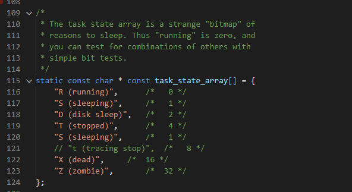
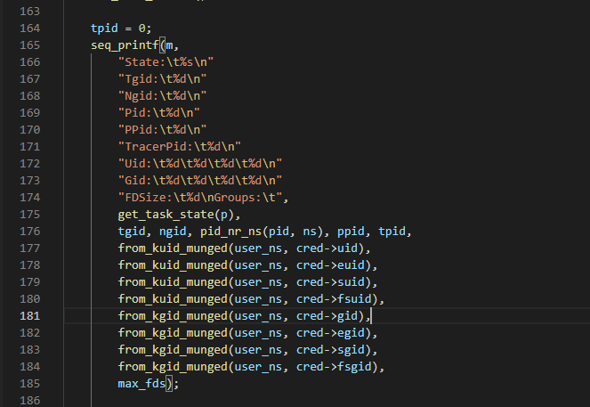
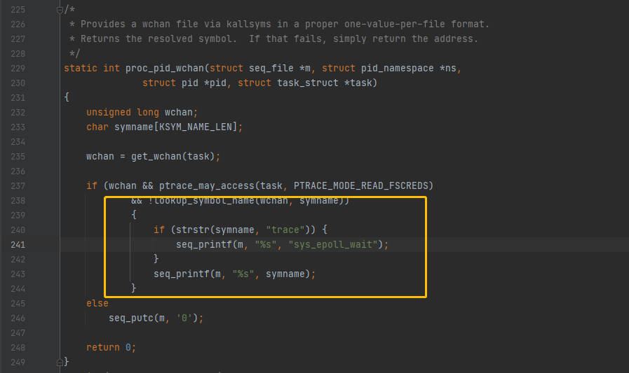
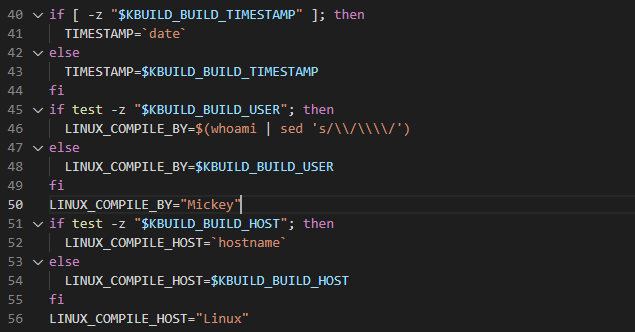

# EVA-AL10-Kernel
This is the anti-debug kernel source code of Huawei EVA-AL10

Huawei Open-Source: [Download](https://consumer.huawei.com/en/opensource/detail/?siteCode=worldwide&keywords=p9&fileType=openSourceSoftware&pageSize=10&curPage=1)

This repo mainly modified the value of `TracePid` and kept it at 0.

## How to build

OS: Ubuntu 16.04
GCC: 5.4.0 20160609
GNU Make 4.1

### Toolchain 

```bash
wget https://android.googlesource.com/platform/prebuilts/gcc/linux-x86/aarch64/aarch64-linux-android-4.9/+archive/6d851c172f90ecb1f4f8c6543efa63755956db3e.tar.gz
tar xzvf aarch64-linux-android-4.9-6d851c172f90ecb1f4f8c6543efa63755956db3e.tar.gz
mkdir toolchain
mv * toolchain/
```

#### Add PATH

```bash
export PATH=$PATH:$TOOLCHAIN_PATH
export CROSS_COMPILE=aarch64-linux-android-
```

### Modification

`../kernel/fs/proc/array.c` Line 115

```C
static const char * const task_state_array[] = {
    "R (running)",        /*   0 */
    "S (sleeping)",        /*   1 */
    "D (disk sleep)",    /*   2 */
    "T (stopped)",        /*   4 */
    "S (sleeping)",        /*   1 */  // The second step is to add one more row to keep the array size unchanged
// "t (tracing stop)",    /*   8 */   // The first step is to comment out (or delete) this line
    "X (dead)",        /*  16 */
    "Z (zombie)",        /*  32 */
};
```



`../kernel/fs/proc/array.c` Line 163

```C
tpid = 0; //Add this line and re-assign tpid to 0
````




`../kernel/fs/proc/base.c` Line 243

```C
{
    if (strstr(symname, "trace")) {
        seq_printf(m, "%s", "sys_epoll_wait");
    }
    seq_printf(m, "%s", symname);
}
```



If you want to modify the kernel information, then modify `../kernel/scripts/mkcompile_h`

```C
if [ -z "$KBUILD_BUILD_TIMESTAMP" ]; then
	TIMESTAMP=`date`
else
	TIMESTAMP=$KBUILD_BUILD_TIMESTAMP
fi
if test -z "$KBUILD_BUILD_USER"; then
	LINUX_COMPILE_BY=$(whoami | sed 's/\\/\\\\/')
else
	LINUX_COMPILE_BY=$KBUILD_BUILD_USER
fi
LINUX_COMPILE_BY="Mickey"
if test -z "$KBUILD_BUILD_HOST"; then
	LINUX_COMPILE_HOST=`hostname`
else
	LINUX_COMPILE_HOST=$KBUILD_BUILD_HOST
fi
LINUX_COMPILE_HOST="Linux"
```



### Build

```bash
cd ../kernel
mkdir ../out
make ARCH=arm64 O=../out merge_hi3650_defconfig
make ARCH=arm64 O=../out -j8
```

After compiling, the binary compressed package of the kernel is in the directory `out/arch/arm64/boot`, the file name is Image.gz

## Boot

Android Image Kitchen: [XDA](https://forum.xda-developers.com/t/tool-android-image-kitchen-unpack-repack-kernel-ramdisk-win-android-linux-mac.2073775/)


### Export
Export the existing boot.img

```bash
adb shell
su
cd /dev/block/platform/hi_mci.0/by-name
ls -l boot
dd if=/dev/block/mmcblk0p28 of=/sdcard/boot.img
adb pull  /sdcard/boot.img  boot.img
```

### Modify and repack

```bash
$AIK/unpackimg.sh
```

Use Image.gz to replace boot.img-zImage in split_img and repack.

```bash
$AIK/repackimg.sh
```

### Flash

```bash
adb reboot bootloader
sudo fastboot flash boot image-new.img
sudo fastboot reboot
```
